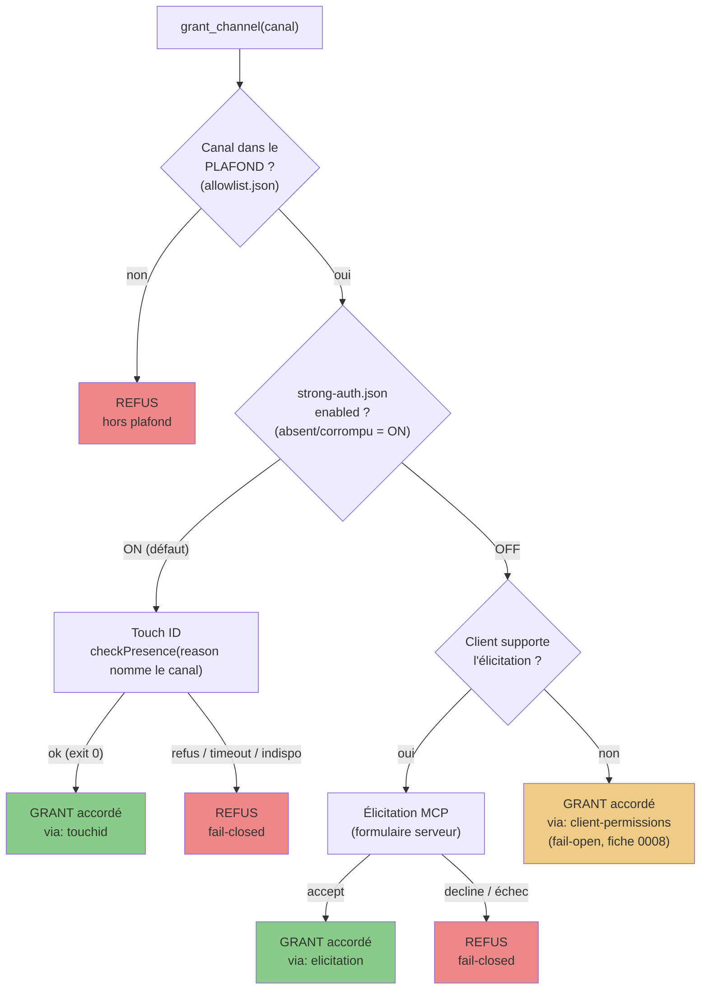
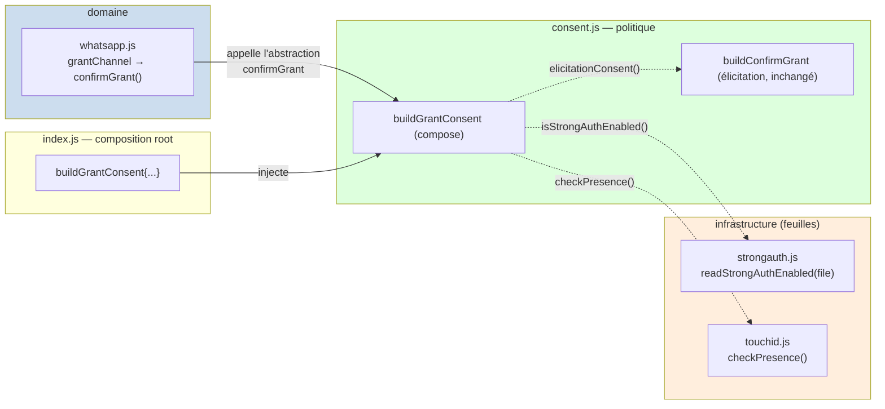

# ADR-0003 : Le consentement par présence (Touch ID) sur `grant_channel`

**Statut :** Accepté
**Date :** 2026-07-23
**Décideurs :** Thomas (propriétaire du projet et du compte WhatsApp)
**Amende :** ADR-0002 (ajoute un cran au consentement ; le plafond et le reste de 0002 survivent intacts)
**Feature :** [0013](../../features/0013-garde-touchid-presence-grant.md) — v1 presence check (0007 = v2 signé, différé)

## Contexte

L'ADR-0002 a posé deux barrières sur `grant_channel` : le **plafond** (`allowlist.json`,
hors de portée du LLM) et le **consentement** par élicitation MCP. Ce consentement a un
angle mort **assumé** (fiche 0008) : quand le client MCP ne supporte pas l'élicitation, le
grant retombe sur les permissions du client — un **fail-open** (`{accepted:true,
via:"client-permissions"}`). Sur un client en mode « auto », `grant_channel` s'exécute donc
sans qu'aucun humain ne valide quoi que ce soit. Le plafond limite la casse, mais rien ne
prouve qu'un **humain était présent** au moment de l'activation.

La faisabilité d'un garde biométrique **imposé côté serveur** a été relevée en conditions
réelles (fiche 0013, 2026-07-22) : un process de session Claude Code peut afficher la boîte
système Touch ID (`LAContext.evaluatePolicy(.deviceOwnerAuthentication)`). Le verdict est
**infalsifiable par un LLM** : `evaluatePolicy` ne réussit que si un prompt a été présenté
**et** validé par une présence physique (Touch ID, Apple Watch, ou mot de passe de session).

La base est déjà livrée (spike 0013) : `scripts/touchid.swift` (helper) et `src/touchid.js`
(`checkPresence(...) → {ok, status}`, **fail-closed** : `ok:true` seulement sur exit 0).
Il reste à **câbler** ce garde dans le consentement, sans casser l'existant.

## Décision

### 1. Une hiérarchie de consentement à trois crans

Le consentement de `grant_channel` se lit désormais comme une échelle, du plus faible au
plus fort :

| Cran | Mécanisme | Prouve | Dépend du client ? |
|---|---|---|---|
| 1 | Permissions du client MCP (fail-open, fiche 0008) | rien (peut être « auto ») | oui |
| 2 | Élicitation MCP (ADR-0002) | un humain a coché un formulaire serveur | oui (capability) |
| 3 | **Touch ID (presence check)** | un humain était **physiquement devant le Mac** | **non — imposé serveur** |

Le cran 3 est le seul **client-indépendant** : il ne demande aucune capability, il ferme
donc l'angle mort du cran 1.

### 2. Le drapeau d'activation — `strong-auth.json`, **human-only, défaut ON**

- Fichier à côté d'`allowlist.json` (`strongAuthFile`, surchargeable par
  `WHATSAPP_STRONG_AUTH_FILE`), même format JSON versionné : `{ "version": 1, "enabled":
  false }` avec un `_doc`.
- **Édité par l'humain, à la main, exclusivement.** Aucun outil MCP ne l'écrit ni ne le
  bascule — la capacité n'existe pas dans le code, **même doctrine que le plafond**
  (ADR-0002). Un LLM confus ne doit pas pouvoir désarmer le garde biométrique.
- **Pas de bootstrap.** Contrairement à `allowlist.json`, le code ne crée jamais ce
  fichier : son **absence est un état valide** qui signifie **ON**.
- Lu **à frais à chaque grant** (une lecture fichier ; le grant est un geste rare). Une
  édition manuelle s'applique sans redémarrage, comme le plafond.

**Sémantique du drapeau — fail-secure « vers le haut » :**

| État du fichier | Touch ID exigé ? |
|---|---|
| Absent | **OUI** (défaut) |
| `{ "enabled": true }` | OUI |
| `{ "enabled": false }` | non → repli élicitation (ADR-0002) |
| Corrompu / illisible | **OUI** (fail-secure) |

> Note : cette valeur par défaut **inverse** celle d'`allowlist.json` (absent = plafond
> *vide*). Ce n'est pas une incohérence : les deux fichiers sont **fail-secure**, mais leur
> rôle diffère. Une *liste de permission* absente doit tout **refuser** (vide) ; un *garde
> de sécurité* absent doit être **armé** (ON). Dans les deux cas, l'absence penche vers le
> plus sûr.

### 3. La bascule du consentement (stratégie composée)

Le point d'injection existant — `wa.confirmGrant`, une fonction unique
`async ({jid, subject}) → {accepted, via?, reason?}` appelée par `grantChannel` **après** le
plafond — reste **le seul** contrat. On ne touche ni `grantChannel` ni `buildConfirmGrant`.
On **compose** :

- Drapeau **ON** → `checkPresence({ reason })` avec un `reason` qui **nomme le canal** :
  « Autoriser la lecture du groupe WhatsApp « ‹subject› » ? ». `ok:true` → `{accepted:true,
  via:"touchid"}` ; sinon → `{accepted:false, reason}` (**fail-closed**).
- Drapeau **OFF** → délégation à la stratégie d'élicitation **actuelle, inchangée**.

Les deux crans sont **mutuellement exclusifs** : Touch ID **remplace** l'élicitation, il ne
s'y ajoute pas (pas de double friction).

### 4. Fail-closed et ordre préservé

- `checkPresence` non-ok (refus, timeout, indisponible, erreur) ⇒ **grant refusé**. Jamais
  d'accord silencieux — le wrapper (`src/touchid.js`) est déjà fail-closed par construction.
- Le **plafond est vérifié AVANT** le prompt Touch ID (ordre de `grantChannel` inchangé) :
  pas de cérémonie biométrique pour un canal hors-plafond qui serait refusé de toute façon.

### Périmètre

`grant_channel` **uniquement**. `revoke_channel` et les lectures
(`get_recent_messages`) ne sont **pas** impactés : révoquer et lire dans son propre plafond
ne justifient pas une présence physique. v1 = **presence check** ; le v2 signé (Secure
Enclave lié à la question, fiche [0007](../../features/0007-elicitation-signee-touch-id.md))
reste différé — gold-plating pour un serveur read-only tant qu'aucune écriture n'existe.

## Schémas

### Le flux de décision de `grant_channel`

*Légende : le chemin d'un grant, de gauche du plus dur au plus souple. Le plafond (haut)
filtre toujours en premier. Rouge = refus (fail-closed), vert = grant après présence/humain
prouvés, orange = grant fail-open sans preuve humaine (l'angle mort que le cran Touch ID
ferme). Le drapeau `strong-auth.json` aiguille entre Touch ID (imposé serveur) et le
comportement d'élicitation de l'ADR-0002.*

### Les frontières des modules (sens des dépendances)

*Légende : les dépendances pointent vers l'intérieur. Le domaine (bleu, `grantChannel`) ne
connaît qu'une abstraction — la fonction `confirmGrant`. La politique (vert, `consent.js`)
reçoit ses collaborateurs par injection (flèches pointillées) ; elle ne référence jamais
`fs` ni Swift en dur, ce qui la rend **testable sans biométrie**. L'infrastructure (orange,
feuilles) est câblée par la composition root. `buildConfirmGrant` n'est pas modifié — il est
composé.*

## Alternatives écartées

- **Appeler `checkPresence` directement dans `grantChannel`** — couple le domaine à Swift et
  à la biométrie, casse la testabilité et court-circuite le seam `confirmGrant` existant.
- **Drapeau en marqueur nu (présence = OFF)** — moins auto-documenté (pas de `version`/`_doc`)
  et sémantique inversée déroutante face à la convention JSON d'`allowlist.json`.
- **Drapeau en variable d'environnement** — s'écarte de la doctrine « fichier édité à la main,
  relu à frais » de l'ADR-0002 ; l'env est fixé par le lanceur du serveur, moins clairement
  human-only qu'un fichier gitignored.
- **Empiler Touch ID *après* l'élicitation** — double friction pour zéro garantie de plus ;
  la présence physique subsume le formulaire.

## Conséquences

**Plus sûr**
- L'angle mort fail-open (cran 1) est **fermé par défaut** : dès l'installation, tout grant
  exige une présence physique, quelle que soit la capability du client.
- Le pire cas d'un mandataire zélé passe de « active un canal du plafond sans formulaire » à
  « ne peut rien activer sans un doigt sur le capteur ».
- Le garde est **imposé serveur** : il ne dépend d'aucune bonne volonté du client MCP.

**Coût accepté**
- Un geste physique par grant quand le drapeau est ON (défaut). Voulu — c'est la preuve de
  présence.
- Sur un Mac sans Touch ID **ni** mot de passe de session configurés, `checkPresence` échoue
  et le grant est refusé (fail-closed). Repli normal : `.deviceOwnerAuthentication` accepte le
  mot de passe macOS, donc ce cas est rare. Désarmable à la main via `strong-auth.json`.

**Inchangé**
- Drapeau OFF ⇒ comportement d'élicitation de l'ADR-0002 **strictement identique** (repli
  fail-open 0008 compris).
- `whatsapp_status.grantConsent` gagne une troisième valeur (Touch ID) quand le drapeau est ON.

**À revisiter**
- v2 signé (fiche 0007) le jour où une capacité d'écriture existerait.
- Confirmation *in situ* depuis le process serveur MCP (et sous Desktop) au test E2E de la
  feature — réserve mineure du relevé 0013.

## Actions

1. [ ] `src/strongauth.js` — `readStrongAuthEnabled(file)` : absent/corrompu = `true` (ON),
       `{enabled:false}` = `false`. Aucune écriture, aucun bootstrap.
2. [ ] `src/config.js` — `strongAuthFile` + `WHATSAPP_STRONG_AUTH_FILE` (à côté d'`allowlistFile`).
3. [ ] `src/consent.js` — `buildGrantConsent({ isStrongAuthEnabled, checkPresence,
       elicitationConsent, log })` ; `buildConfirmGrant` inchangé.
4. [ ] `src/index.js` — composer `wa.confirmGrant` via `buildGrantConsent` ; `grantConsent`
       de `whatsapp_status` reflète Touch ID quand le drapeau est ON.
5. [ ] `.gitignore` — `strong-auth.json`.
6. [ ] `test/consent-strongauth.js` — routage ON→Touch ID / OFF→élicitation, fail-closed
       (checkPresence non-ok → refus), lecture du drapeau (absent/`false`/corrompu), le tout
       avec `checkPresence` et `isStrongAuthEnabled` **injectés** (zéro biométrie en test).
       Biométrie réelle = relevé humain (E2E).
7. [ ] README + `.env.example` — le drapeau, son défaut ON, comment le désarmer à la main.
