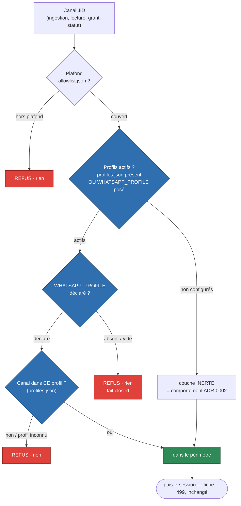

# ADR-0006 : Profils par projet — périmètre effectif = plafond ∩ profil

**Statut :** Accepté
**Date :** 2026-09-10
**Décideurs :** Thomas (propriétaire du projet et du compte WhatsApp)
**Amende :** ADR-0002 (referme sa ligne « Profils par projet — Différé, phase 1.5 bis »)
**Épic :** [20260902223310355](../../features/20260902223310355_acces-whatsapp-par-session.md) (accès par session) — couche STATIQUE

## Contexte

Le plafond (ADR-0002, `allowlist.json`) est GLOBAL : tout client qui lance le serveur voit
les mêmes canaux. Thomas veut que chaque projet (répertoire) ne lise que les groupes dont
il a besoin — le projet copro ne voit que la copro — sans que le LLM ait à le demander.

Deux contraintes de conception, imposées par la fiche 0004 et l'épic :

1. **Déclaration explicite, jamais de détection.** Le `.mcp.json` du projet pose
   `WHATSAPP_PROFILE=<nom>`. On ne devine PAS le profil depuis le `cwd` : un chemin est
   fragile (worktrees, liens) et falsifiable.
2. **Les JID privés ne quittent pas le poste.** Seul le NOM du profil est écrit dans le
   repo consommateur (`.mcp.json`). La correspondance nom → canaux vit CÔTÉ SERVEUR, dans
   un fichier non commité.

Le reste du modèle est déjà en place : le plafond borne déjà l'ingestion, la lecture, le
grant et le statut par UN seul prédicat, `_ceilingHas(jid)`. C'est le point d'appui.

## Décision

### 1. Le profil est une SECONDE borne, au même point d'autorité

On introduit un prédicat composé, unique, qui remplace `_ceilingHas` sur les chemins
consommateurs :

    _inScope(jid) = _ceilingHas(jid)  ET  _profileHas(jid)

- `_ceilingHas` reste inchangé : le plafond, avec sa garde anti-homonyme (le JID prime, un
  nom ambigu est refusé) et son rechargement à chaud.
- `_profileHas` est le nouveau prédicat de profil, décrit ci-dessous.

Le profil n'a PAS besoin de re-vérifier l'identité forte : `_inScope` exige d'abord
`_ceilingHas`, donc la garde anti-usurpation du plafond couvre déjà le profil. Le profil
est un simple test d'appartenance PAR-DESSUS.

### 2. Le fichier de mapping — `profiles.json`, côté serveur, humain

- À la racine du projet, gitignored, surchargeable par `WHATSAPP_PROFILES_FILE`.
- Édité par l'humain, à la main. Aucun outil MCP n'y écrit, aucun code ne le génère (pas de
  `bootstrap`, contrairement au plafond) : un profil ne s'auto-crée jamais.
- Schéma (version 1), où chaque profil réutilise le format d'entrées du plafond
  (chaîne = nom exact OU JID, ou objet `{ jid, name }`) — on réutilise `parseAllowlist` :

      {
        "version": 1,
        "profiles": {
          "copro":   ["Copro Reine Blanche", { "jid": "1203…@g.us", "name": "Basket loisir" }],
          "famille": ["1203…@g.us"]
        }
      }

- Fichier absent ou corrompu = aucune correspondance (fail-closed), même règle que le plafond.
- Permissions `0600` recommandées (JID privés). Comme aucun code n'écrit ce fichier, la
  responsabilité du mode est humaine ; le `.gitignore` empêche la fuite dans le repo.

### 3. `_profileHas` — activation opt-in, puis fail-closed

    _profileHas(jid) :
      profile.refresh()                              # rechargement à chaud (stat mtime+taille)
      declared = (WHATSAPP_PROFILE || "").trim()
      active = declared != ""  OU  profiles.json existe
      si NON active         -> return true           # profils non configurés : couche INERTE (ADR-0002)
      si declared == ""     -> return false          # configurés mais process non déclaré : RIEN (fail-closed)
      subject = grant.subject ?? knownGroups[jid]
      return profile.permits(declared, jid, subject) # profil inconnu / canal absent -> false -> RIEN

### 4. Fraîcheur : rechargement à chaud, comme le plafond

`profiles.json` se recharge sur `stat` (mtime+taille) à chaque décision, via
`Profiles.refresh()`, exactement comme `Allowlist.refresh()`. Une correction manuelle du
mapping s'applique sans redémarrage. Le NOM du profil, lui, est figé pour la vie du process
(il vient de l'environnement posé par le lanceur) — c'est voulu : le périmètre suit le
checkout, pas une mutation en cours de route.

### 5. Ce qui NE change PAS

La couche session (jeton porté, fiche …499) et la provenance de consentement (fiche 0008)
sont intactes. Le périmètre final reste **plafond ∩ profil ∩ session**. Le consentement
n'est pas rouvert.

*Légende : un canal n'est servi que s'il franchit le plafond PUIS le profil ; vert = passe,
rouge = refus fail-closed, bleu = la nouveauté (couche profil). Non configurée, la couche
est inerte et on retombe sur l'ADR-0002 ; le résultat est ensuite encore borné par la session.*

## Alternatives écartées

| Option | Sort | Raison (une ligne) |
|---|---|---|
| Intersecter au chargement de l'allowlist (plafond ∩ profil fusionnés en mémoire) | Rejeté | Mélange deux responsabilités (loi machine vs restriction projet), casse le sens de `refresh()` et la garde anti-homonyme. |
| Détecter le profil depuis le `cwd` | Rejeté (par la fiche) | Fragile (worktrees, liens) et falsifiable ; la déclaration explicite est la seule source fiable. |
| « Sans profil → rien » inconditionnel | Rejeté pour le POC | Briderait par régression le seul consommateur actuel et tout client non encore migré ; le fail-closed est scopé à « profils activés » (voir Conséquences). |
| Nouveau format de fichier propre au profil | Rejeté | Réutiliser le format + le parseur du plafond (`parseAllowlist`) est plus simple et cohérent (DRY). |

## Conséquences

**Plus sûr / plus simple**
- Un seul point d'autorité de plus (`_profileHas`), composé dans `_inScope` : les six
  appelants (`_ingest`, `listGroups`, `grantChannel`, `recentFor`, `_revalidateGrants`,
  `status`) basculent de `_ceilingHas` à `_inScope` sans autre changement.
- Fail-closed hérité du plafond : fichier absent/corrompu, profil non déclaré, profil
  inconnu → rien.
- Réutilise `parseAllowlist` et le motif `refresh()` : peu de code neuf, comportements
  déjà testés.

**Compromis assumé — le fail-closed est scopé à l'activation**
- « Sans profil → rien » vaut UNE FOIS les profils configurés (fichier présent, ou profil
  déclaré). Sans aucun signal profil, la couche est inerte et le serveur se comporte comme
  avant (plafond seul). Motivation : activer la fonctionnalité (créer `profiles.json`, ou
  poser `WHATSAPP_PROFILE`) est l'acte explicite d'opt-in ; on ne régresse pas les clients
  qui n'ont rien demandé. La garantie de sécurité tient là où elle compte : un déploiement
  qui a adopté les profils ne laisse jamais un process non déclaré tout lire.

**À revisiter (fiche 0005, démon + frontends)**
- Aujourd'hui, un process = un projet = un profil, donc appliquer le profil AUSSI à
  l'ingestion est correct et le plus simple. Quand le démon arrivera, la capture devient
  machine-wide (plafond ∩ grants, SANS profil, car le démon n'en a pas) et la borne profil
  devra migrer vers la frontière de LECTURE (le frontend porte le profil). Ce déplacement
  est explicitement la charge de la fiche 0005 ; on ne le construit pas maintenant (YAGNI).

## Actions

1. [ ] `src/profiles.js` — classe `Profiles` (load fail-closed, `refresh()` sur mtime+taille,
       `permits(name, jid, subject)`), réutilisant `parseAllowlist` et `allowlistPermits`.
2. [ ] `src/config.js` — `profile` (env `WHATSAPP_PROFILE`) + `profilesFile`
       (env `WHATSAPP_PROFILES_FILE`, défaut `profiles.json`).
3. [ ] `src/whatsapp.js` — `_profileHas()`, `_inScope()`, bascule des six appelants ;
       stub inerte par défaut dans le constructeur.
4. [ ] `src/index.js` — instancie `Profiles` et l'injecte dans `WhatsAppClient`.
5. [ ] `.gitignore` — `profiles.json` + `profiles-*.json`.
6. [ ] `test/profiles.js` — parsing/fail-closed, intersection, sans-profil→rien,
       profil-inconnu→rien, deux configs même profil→même périmètre, couche inerte.
7. [ ] README + `.env.example` — `WHATSAPP_PROFILE`, `WHATSAPP_PROFILES_FILE`, exemple.
