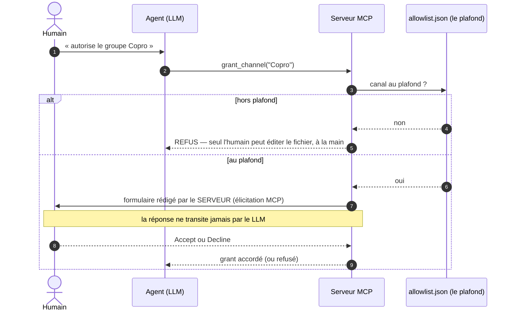

# La question que le LLM ne peut pas trafiquer

*Comment j'ai découvert que mon agent pouvait s'autoriser tout seul à lire mes messages WhatsApp — et ce que j'ai construit pour que ça ne soit plus jamais possible.*

*Lecture : ~4 minutes. Projet : [whatsapp-group-mcp](https://github.com/elzinko/whatsapp-group-mcp), un serveur MCP qui permet à Claude de lire — en lecture seule — les groupes WhatsApp que j'autorise explicitement.*

---

## Le problème

Un soir, je demande à Claude d'autoriser la lecture d'un de mes groupes WhatsApp. Une boîte de dialogue s'affiche : *« Do you want to proceed? »*. Je valide, satisfait : l'humain est dans la boucle, tout va bien.

Puis je réalise un détail qui change tout : dans la moitié de mes projets, **cette boîte de dialogue ne s'affiche jamais**. Comme beaucoup de développeurs, j'ai passé mes projets de confiance en mode permissions « auto » — l'agent y exécute ses outils sans me demander. Dans ces projets-là, mon agent pouvait appeler `grant_channel` — l'outil qui ouvre un groupe à la lecture — **et se l'accorder tout seul**.

Mes messages privés. Le groupe famille, le groupe copro, vingt ans de conversations. Et la seule barrière était une boîte de dialogue... optionnelle.

## Le contexte

Première réaction réflexe : « il faut sécuriser, des tokens, de l'authentification ! ». Mauvaise réponse, parce que mauvais attaquant.

Mon serveur tourne en local, sans port ouvert. Personne ne peut l'atteindre de l'extérieur. Et un token d'authentification stocké sur le même disque, dans le même compte utilisateur que les données qu'il protège, n'authentifie rien du tout. Le « monde entier » n'est pas dans la pièce.

Le vrai attaquant, je l'avais sous les yeux : **c'est le mandataire lui-même**. Pas par malveillance — par zèle. Un agent qui, pour « analyser l'ambiance de la copro », décide que le groupe famille est aussi pertinent. Ou pire : un message WhatsApp piégé — les messages sont des données hostiles par défaut — qui souffle à l'agent d'élargir son propre périmètre. Les anciens appellent ça le *confused deputy* : le danger n'est pas l'intrus, c'est le fondé de pouvoir trop puissant.

Une fois le problème posé ainsi, le diagnostic tombe : ma boîte de dialogue était le **mauvais gardien au mauvais endroit**. C'est le *client* MCP qui l'affiche — et chaque client en fait ce qu'il veut, mode « auto » compris. Le serveur, lui, obéissait à quiconque l'appelait.

## La solution

Déplacer le lieu du contrôle : du client — à géométrie variable — vers le serveur, qui est le seul point de passage obligé. Deux mécanismes, du plus dur au plus souple.

**1. Le plafond.** Un fichier `allowlist.json` à la racine du serveur, qui liste les canaux que le serveur a le *droit* de servir. Sa propriété clé : **aucun outil MCP ne sait y écrire — la capacité n'existe pas dans le code**. Pour ajouter un groupe au périmètre, il faut ouvrir un éditeur de texte. C'est une friction volontaire : c'est exactement le geste qu'un LLM ne peut pas faire à ma place. Hors plafond, un canal n'est ni autorisable, ni lisible, ni même conservé en mémoire.

**2. Le consentement.** Pour activer un canal *déjà au plafond*, le protocole MCP offre un mécanisme méconnu : l'**élicitation**. Le serveur envoie au client une question qu'il a **rédigée lui-même** — avec le vrai nom du groupe, résolu depuis WhatsApp, pas celui que l'agent prétend — et le client l'affiche comme un formulaire natif. Ma réponse, Accept ou Decline, repart **directement au serveur : elle ne transite jamais par le LLM**, qui ne peut donc ni la rédiger, ni la falsifier, ni la contourner.

L'agent reste l'initiateur — je lui parle, il travaille. Mais le périmètre du possible est dans un fichier hors de sa portée, et l'activation passe par une question qu'il ne peut pas trafiquer.

## L'implémentation

L'essentiel tient en peu de choses, et chaque détail découle du modèle de menace :

- **Fail closed, partout.** Fichier plafond absent ou corrompu → périmètre vide. Formulaire qui échoue → refus. Un grant dont le canal sort du plafond n'est pas supprimé mais **suspendu** — inerte tant que je ne le réintègre pas à la main.
- **Le nom vient toujours du serveur.** Le formulaire affiche le nom du groupe résolu depuis WhatsApp, jamais un texte fourni par l'agent. Une approbation n'a de valeur que si on sait ce qu'on approuve.
- **Pas de champ à remplir.** Premier essai : un booléen « autoriser » à cocher, en plus des boutons Accept/Decline. Redondant et pénible — les deux boutons *sont* déjà la réponse du protocole. Schéma vidé.
- **Testable sans humain... sauf l'essentiel.** Le SDK MCP fournit un client scriptable : mes tests déclarent la capability élicitation, reçoivent le formulaire et y répondent par programme, via un transport en mémoire. Tout le protocole est couvert. Mais la propriété finale — *un humain a répondu* — est par construction invérifiable par du code : un test qui répond au formulaire est précisément un robot. Cette limite n'est pas un défaut, c'est la définition même de ce qu'on protège.

Le serveur reste par ailleurs ce qu'il était : lecture seule (l'outil d'envoi n'existe pas), un seul appareil WhatsApp lié, tout en local.

La suite logique est déjà au backlog : remplacer un jour le clic Accept par une **signature à présence physique** — Touch ID, clé en Secure Enclave — pour sortir même le client MCP de la base de confiance. Après la question que le LLM ne peut pas trafiquer : la réponse que seul mon doigt peut donner.

---

*La leçon, généralisable à tout serveur MCP qui touche à des données sensibles : ne demandez pas au client d'être votre gardien — il ne vous doit rien. Le périmètre dans un fichier hors de portée des outils, le consentement rédigé par le serveur, et le refus comme comportement par défaut.*
