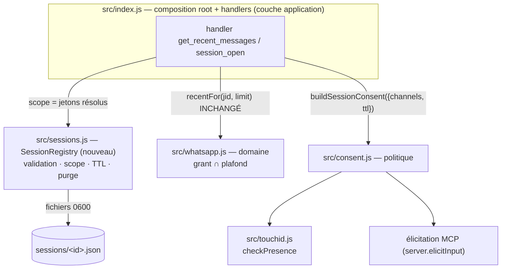

# 20260902223310499 — Droits par session (jeton porté dans chaque appel)

**En clair.** Chaque conversation obtient son propre périmètre de lecture WhatsApp. Le LLM
demande `session_open` pour des groupes précis ; macOS affiche Touch ID avec leurs noms ; le
serveur rend un jeton que le LLM présente ensuite à chaque lecture. Sans jeton, rien ne se
lit. Deux conversations sur la même connexion Desktop/Cowork ne se voient plus.

**Si tu arrives frais.** Vocabulaire (plafond, grant, session, Cowork) dans l'épic parent
[20260902223310355](20260902223310355_acces-whatsapp-par-session.md).

## Contexte / Problème

- Les grants (`settings.json`) sont **globaux** : tout client et toute conversation lisent
  les mêmes groupes. Une tâche Cowork « résume le groupe famille » voit aussi la copro.
- Sous Desktop/Cowork, toutes les conversations passent par **une seule** connexion MCP :
  le serveur ne peut pas les distinguer. Le protocole MCP ne transmet aucun identifiant de
  conversation (constat google, ADR-0007 et fiche 0101). Le seul moyen robuste : un **jeton
  porté dans chaque appel**.
- Valeur : minimisation de données par conversation (ADR-0002), usage parallèle réel
  (8 serveurs constatés le 2026-09-03), et le socle du jour où `send` reviendrait
  (ADR-0001).

## Proposition

### Contrat des outils (surface MCP)

| Outil | Aujourd'hui | Après |
|---|---|---|
| `whatsapp_help`, `whatsapp_status` | libres | libres ; `status` affiche la session si `session` est fourni (scope, expiration) ; sinon « aucune session » + nombre de sessions actives (jamais leur contenu) |
| `list_groups` | libre | `session` optionnel : marque `inSession` en plus de `granted` |
| `grant_channel` / `revoke_channel` | Touch ID | **inchangés** — c'est **capter** (ingestion, machine-wide) |
| `get_recent_messages` | libre | **exige `session`** ; canal hors session → refus, message qui guide vers `session_open` |
| `session_open` (nouveau) | — | `channels[]` (⊆ grants ∩ plafond, sinon refus **avant** tout prompt), `ttl?` ; Touch ID nomme les groupes et la durée ; renvoie `{ session, expiresAt, channels }` |
| `session_close` (nouveau) | — | révoque le jeton présenté (réduire est toujours permis : pas de cérémonie) |

### Registre et cycle de vie

- Dossier `sessions/` à côté de `settings.json` (gitignored, `0700`), un fichier par jeton :
  `{ id, channels, createdAt, expiresAt, lastSeenAt }`. Jeton opaque (128 bits aléatoires).
- **Fail-closed** : jeton absent, inconnu, expiré, fichier corrompu → refus journalisé.
- Fin de vie = **TTL** (défaut proposé : 8 h) ou **révocation** (`session_close`, ou CLI
  humaine `npm run sessions -- list|close <id>|close --all`). La déconnexion MCP ne purge
  rien (ADR-0007, décision 5 : jeton au porteur, pas d'id de conversation observable).
- Le plafond est re-vérifié à chaque lecture : session ∩ plafond **courant** (un canal sorti
  du plafond est suspendu même en session, comme ADR-0002).
- `lastSeenAt` avance à chaque appel (audit, purge des sessions mortes).

### Consentement

- `session_open` réutilise `checkPresence({ reason })` (ADR-0003) avec un motif qui nomme
  les groupes et la durée : « Ouvrir une session de lecture WhatsApp sur « A », « B »
  pendant 8 h ? ». Ordre préservé : vérification ⊆ grants ∩ plafond **avant** le prompt.
- Drapeau `strong-auth.json` OFF → élicitation (formulaire serveur listant les groupes).
  Client sans élicitation → **fail-closed** (pas de repli « permissions client » : une
  session est un périmètre, pas un grant déjà plafonné). Ce choix tranche 0008 pour
  `session_open` seulement ; `grant_channel` reste à trancher dans 0008.
- Le v2 signé ([0007](0007-elicitation-signee-touch-id.md)) lierait le jeton au payload
  exact ; optionnel tant que le serveur est en lecture seule.

### Compatibilité

- Rupture assumée : `get_recent_messages` sans jeton refusera. Le consommateur scripté
  `elzinko/elzinko` (PR #17, sous-process stdio pour ingestion) devra présenter un jeton
  **émis par la CLI humaine** (longue durée, révocable) — pas de mode « sessions off ».
- `whatsapp_help` et les descriptions d'outils décrivent le nouveau flux :
  `whatsapp_status → session_open → get_recent_messages(session)`.

## Critères d'acceptation

- [ ] Sans `session`, `get_recent_messages` refuse, avec un message qui guide vers
      `session_open` — testé.
- [ ] `session_open` refuse tout canal hors grants ∩ plafond **avant** le prompt Touch ID —
      testé.
- [ ] Touch ID refusé, absent, en timeout, ou client sans élicitation avec drapeau OFF →
      aucune session (fail-closed) — testé avec `checkPresence` injecté (fixture
      `test/fixtures/fake-touchid.sh`).
- [ ] Deux jetons, deux scopes : la lecture croisée est refusée — test hermétique (transport
      mémoire, comme `test/elicitation.js`).
- [ ] Jeton expiré ou clos → refus ; `lastSeenAt` avance ; fichier de session corrompu →
      refus — testé.
- [ ] Canal retiré du plafond → suspendu même en session (relecture à chaud) — testé.
- [ ] `whatsapp_status(session)` montre scope + expiration ; sans jeton : « aucune session »
      + nombre de sessions actives.
- [ ] CLI `npm run sessions -- list|close` ; révocation effective sans redémarrage.
- [ ] Le prompt Touch ID nomme les groupes et la durée — constaté à la main, depuis Code
      **et** depuis Desktop/Cowork.
- [ ] README (outils, flux) et `whatsapp_help` à jour ; ADR court (modèle ADR-0007 google,
      adapté) écrit, accepté, lié depuis le README.
- [ ] `npm test` vert ; CI de la PR (Node 20/22 + CodeQL) verte.

## Comment vérifier

```bash
npm test                    # suites existantes + test/sessions.js (nouveau)
npm run test:elicitation    # modèle : protocole réel Server/Client en mémoire
```

À la main : ajouter un « Test E — session » à
[docs/tests/validation-manuelle-desktop.md](../docs/tests/validation-manuelle-desktop.md)
(prompts : ouvrir une session sur un groupe, lire ce groupe, tenter un autre groupe → refus,
fermer la session → refus).

## Décision d'architecture (grooming ezk-architect, 2026-09-03)

**En clair.** On ajoute une couche fine « session » **au-dessus** du domaine, pas dedans. Un
nouveau module `src/sessions.js` tient un registre de jetons (un fichier par jeton, comme
`settings.json`). Le domaine `src/whatsapp.js` **ne change pas** : il connaît toujours le
grant et le plafond, jamais les sessions. C'est `src/index.js` qui compose les deux, comme il
compose déjà le consentement Touch ID. Le jeton n'authentifie personne. Il sélectionne un
périmètre de lecture ouvert par un doigt, borné et périssable.

### Décision

1. **Frontières.** Nouveau module `src/sessions.js` : une classe `SessionRegistry(dir)` qui
   persiste un fichier par jeton et porte la logique pure (validation, scope, TTL, purge). Il
   suit la convention `Settings`/`Allowlist` : classe + chemin injecté, testable sur un
   `tmpdir`. **Le domaine `whatsapp.js` reste inchangé.** La session est un **filtre appliqué
   dans la couche application** (les handlers de `index.js`), en amont du domaine. `index.js`
   résout le jeton en une liste de JID, vérifie que le canal demandé est dans ce périmètre,
   puis appelle `recentFor(jid, limit)` comme aujourd'hui. Défense en profondeur : la garde
   session est en amont, la garde `grant ∩ plafond` reste dans le domaine, en aval.
2. **Transport du jeton.** Paramètre explicite `session` dans l'`inputSchema` des outils, sur
   le modèle google (`_SESSION_PROPERTY`). Requis sur `get_recent_messages`, optionnel sur
   `list_groups` et `whatsapp_status`. Écarté : `_meta` MCP (pas dans le schéma, le LLM ne
   sait pas le porter, instable) ; un outil `select_session` (ce serait un état global de
   process, exactement le bug que l'ADR-0007 corrige sous Desktop).
3. **Consentement de `session_open`.** On **compose** le seam existant, comme l'ADR-0003. Un
   nouveau `buildSessionConsent` injecte `checkPresence` et l'élicitation, et rend un motif
   qui nomme les groupes et la durée. Drapeau `strong-auth.json` ON → Touch ID (imposé
   serveur, marche depuis tout client). OFF → élicitation. Client sans élicitation **et**
   drapeau OFF → **fail-closed** (la fiche a raison). Raison : une session **ouvre un
   périmètre neuf**, ce n'est pas un grant déjà borné par le plafond. Le repli « permissions
   client » de la fiche 0008 vaut pour `grant_channel` (plafonné), pas pour l'ouverture d'un
   périmètre de conversation. Cohérent avec 0008 : objet différent, règle différente.
4. **Capter vs lire : deux gestes, pas un.** `session_open` exige `channels ⊆ grants ∩
   plafond`, sinon refus **avant** tout prompt. **Pas** de grant + session en un seul doigt en
   v1. Raison : le reçu Touch ID doit dire exactement ce qu'il accorde. Capter est persistant
   et machine-wide ; ouvrir une session est éphémère et local à la conversation. Mélanger les
   deux sous un doigt brouille ce que l'humain autorise, et un message piégé pourrait pousser
   à **capter** (durable) sous couvert d'**ouvrir** (fugace). Recommandation : garder deux
   gestes ; si la friction gêne, un outil dédié le dira plus tard, explicitement.
5. **Cycle de vie.** Fichier `sessions/<id>.json` = `{ id, channels, createdAt, expiresAt,
   lastSeenAt }`. Jeton opaque de 128 bits (`crypto.randomBytes(16)`). Dossier `0700`, fichiers
   `0600`, écriture atomique `tmp`+`rename` (comme `settings.js`). TTL défaut 8 h,
   surchargeable par variable d'environnement. **Purge paresseuse à la lecture** : à chaque
   résolution, un jeton expiré est supprimé et refusé sur-le-champ (modèle `get_session`
   google), sans attendre un balayage. Balayage opportuniste en plus à chaque `session_open`
   et `whatsapp_status`. **Pas de timer** : chaque client lance son propre serveur, un timer
   mourrait avec le process ; la purge paresseuse est sans état et robuste. `lastSeenAt` avance
   à chaque résolution réussie. Révocation : `session_close(session)` plus CLI humaine
   `npm run sessions -- list|close <id>|close --all`. **La déconnexion MCP ne purge rien** :
   le jeton est au porteur, MCP ne transmet aucun id de conversation, le serveur ne peut donc
   pas savoir quels jetons appartiennent à la connexion qui tombe. Sous Desktop, une seule
   connexion porte plusieurs conversations : purger à la déconnexion tuerait les voisines.
   Fin de vie = TTL ou révocation, jamais le transport.
6. **Migration vers 0005.** Le démon reprend `sessions/` **tel quel** : même format de
   fichier, même jeton opaque, même logique de validation/TTL/purge. Le registre déménage du
   process-par-client vers le démon unique sans changer le contrat des outils, parce que la
   source de vérité est le fichier, pas la mémoire du process. Les frontends minces
   **transportent** le paramètre `session` jusqu'au démon sans jamais le lire ni l'interpréter.
   Le consentement (Touch ID / élicitation) reste dans le frontend, au plus près du client
   (choix 0005). Bonus : le démon étant un process long, il pourra ajouter un vrai timer de
   purge — utile, pas requis.
7. **Sécurité : sélecteur de périmètre, pas authentification.** Un jeton en clair sur le même
   disque, dans le même compte, n'authentifie personne (ADR-0002 : « tokens locaux =
   théâtre »). Ce jeton est un **sélecteur de périmètre lié à un geste humain**. Il **protège**
   contre la confusion entre conversations (deux tâches Cowork sur une connexion ne se voient
   plus) et contre l'injection (un message piégé peut faire *demander* `session_open` ; seul le
   doigt, qui lit les noms des groupes, l'*accorde*). Il **ne protège pas** contre une machine
   compromise (un shell libre lit `sessions/`, lit `data/`, appelle le serveur nu) ni contre un
   transcript qui fuite le jeton (quiconque le lit peut le rejouer jusqu'à expiration ou
   révocation). Bornes : TTL court, scope minimal (⊆ grants ∩ plafond, lecture seule),
   révocation immédiate, plafond re-vérifié à chaud, jeton jamais affiché d'une conversation à
   l'autre. Modèle coopératif durci, pas cryptographiquement étanche (le vault est hors
   périmètre d'un serveur en lecture seule).
8. **Compatibilité `elzinko/elzinko`.** Le consommateur scripté obtient un jeton par la **CLI
   humaine longue durée** : `npm run sessions -- open --channels <jids> --ttl <long>` déclenche
   Touch ID une fois, puis imprime un jeton que le script porte dans une variable
   d'environnement. Longue durée, révocable, borné aux mêmes `grants ∩ plafond`. Pas de mode
   « sessions off » : sans jeton, rien ne se lit (rupture assumée). L'humain ouvre une fois, le
   script rejoue jusqu'au TTL ou à la révocation.

### Frontières des modules (sens des dépendances)



*Légende. Les flèches vont vers l'intérieur (l'application dépend du domaine et du registre,
jamais l'inverse). `whatsapp.js` et `sessions.js` s'ignorent : `index.js` les compose, comme
il compose déjà `consent.js`. Bleu implicite = code existant intact ; le seul nouveau nœud
domaine-adjacent est `sessions.js`.*

### Alternatives écartées

- **Injecter un resolver de session dans `wa`** (comme `confirmGrant`). Écarté : coupler le
  domaine au concept de session viole SRP ; le domaine n'a aucune raison de connaître les
  jetons. Le filtre vit dans l'application.
- **Fonctions pures + persistance injectée** plutôt qu'une classe. Écarté pour l'uniformité :
  `Settings` et `Allowlist` sont déjà des classes à fichier injecté ; une 3ᵉ forme
  fragmenterait le style sans gain.
- **Jeton via `_meta` ou `select_session`.** Écarté : voir décision 2 (invisible au LLM, ou
  état global de process — le bug d'origine).
- **Grant + session en un doigt.** Écarté : voir décision 4 (le reçu Touch ID mélangerait deux
  portées de durée et d'effet).

### Risques et ce qui reste ouvert pour Thomas

- **TTL par défaut** (produit, à toi) : 8 h recommandé (aligné google). À confirmer.
- **Livraison du jeton** (produit, à toi) : outil `session_open` **recommandé** (pas de
  copier-coller ; « le LLM propose, l'humain autorise »), CLI en repli pour les scripts.
- **Durée du jeton CLI** pour `elzinko/elzinko` (produit, à toi) : proposer 30 j, révocable.
- **Risque : fuite du jeton dans un transcript.** Un jeton lu dans l'historique est rejouable
  jusqu'au TTL. Atténué par TTL court et révocation. C'est le compromis assumé de tout jeton
  au porteur (identique côté google).
- **Risque : re-vérification du plafond à chaud.** Déjà porté par `_ceilingHas` du domaine ;
  la session n'ajoute rien à re-tester côté plafond, elle empile juste sa propre garde.
- **Ouvert (0005) : le geste de consentement dans le frontend.** Quand le démon arrivera, le
  frontend gardera le doigt et le démon lui fera confiance. À re-trancher au sprint 0005 si un
  frontend devient semi-fiable (alors : élicitation signée 0007).

### Squelette de l'ADR à écrire au sprint (numéro non attribué)

> **ADR-000x — Droits par session : un jeton porté, un périmètre ouvert par un doigt**
>
> **Contexte.** Les grants sont globaux ; sous Desktop/Cowork, plusieurs conversations
> partagent une connexion MCP, que le protocole ne sait pas distinguer (ADR-0007 google). Un
> périmètre par conversation exige un jeton porté dans chaque appel.
>
> **Décision.** Registre `src/sessions.js` (un fichier par jeton, 128 bits, TTL, purge
> paresseuse, révocation CLI). Paramètre `session` requis sur la lecture. `session_open` sous
> Touch ID (ou élicitation ; fail-closed sinon), scope ⊆ grants ∩ plafond, deux gestes
> distincts pour capter et lire. Le domaine `whatsapp.js` reste inchangé ; `index.js` compose.
> La déconnexion MCP ne purge rien.
>
> **Conséquences.** Rupture : `get_recent_messages` sans jeton refuse. Isolation entre
> conversations, pas authentification. Le registre migre tel quel dans le démon (0005). Bornes
> assumées : jeton au porteur, modèle coopératif durci, pas étanche.

## Glossaire

- **Jeton porté** — identifiant opaque que le LLM passe dans chaque appel de lecture ; il
  vaut pour un scope et une durée, pas pour une identité.
- **Fail-closed** — en cas de doute (jeton absent, fichier corrompu, cérémonie impossible),
  le serveur refuse ; il n'accorde jamais par défaut.

## Notes / décisions

- Dépendance externe : `google-mcp-multi-account` — accès constaté le 2026-09-03
  (`docs/adr/ADR-0007-droits-par-session.md`, `gateway/sessions.py`,
  `gateway/mcp_server.py` paramètre `session` sur chaque tool, `mag session open`).
- Points ouverts (Thomas) : (1) livraison du jeton — outil `session_open` (recommandé) ou
  CLI à coller ; (2) TTL par défaut (8 h proposé) ; (3) un seul doigt pour grant + session
  quand le canal n'est pas encore capté ? (4) v2 signé (0007) requis avant tout `send`
  futur, pas avant.
- Ordre proposé : cette fiche **avant** 0005 (utile seule sous Desktop/Cowork) ; le démon
  reprend ensuite le registre de sessions tel quel.
